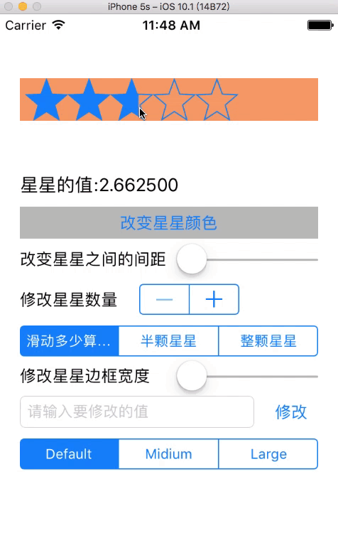
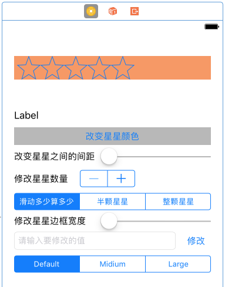

# PCStarRatingView

[]()
[]()
[]()

星星评分控件

通过CoreGraphics绘制星星，无需设置星星图片，更有多种显示效果可选	，所有样式已定义在`PCStarRatingViewRadiusType`枚举中。

----





----

## 使用示例

``` ObjC
PCStarRatingView *starView = [[PCStarRatingView alloc] init];
[starView setFrame:CGRectMake(20.0, 100.0, 300.0, 40.0)];
[starView setValue:2.0];
[starView setBorderWidth:2.0];
[starView setStarState:PCStarRatingViewStateHalf];
[starView setStarTintColor:[UIColor redColor]];
[starView setBackgroundColor:[UIColor orangeColor]];
[starView addTarget:self
             action:@selector(starValueDidChanged:)
   forControlEvents:UIControlEventValueChanged];
[self.view addSubview:starView];
```

更多用法请参看Demo.

## 手动安装

- 将`PCStarRatingView`目录拖入你的项目中
- 导入头文件: `#import "PCStarRatingView.h"`

## License
`PCStarRatingView`基于MIT License进行开源，更多内容请参看`LICENSE`文件。
